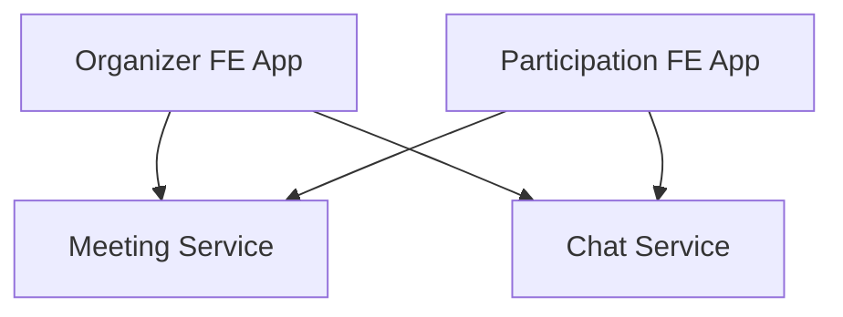

## Architecture design & Solution proposal

### Overview

Front-End Applications:

- Organizer FE App: A React application used by meeting organizers to schedule meetings and suggest meeting times.
- Organizer FE App: A React application for meeting participants to vote on suggested times and engage in chat.

Both applications include real-time chat functionality implemented using the Socket.IO client.

Back-End Services:

- RESTful Meeting Service: Provides meeting-related data (e.g., meeting times, participant info) as JSON responses. This service handles CRUD operations related to meeting management.
- Chat Service: Manages real-time communication using Socket.IO on top of an Express.js server. This service handles websocket connections for delivering chat messages between users. It also securely stores the chat logs.

Both BE services implement an authentication and authorization.

### Monorepo
In the heart of a proposed architecture design lies the monorepo principle.
It enables the sharing of the code, which in its turn promotes the reduction of duplication and hence helps to save developers time.
Also it simplifies the version control and dependency management.

### Node.js + Socket.io
Node.js is a suitable choice for a system like Live chat as its non-blocking I/O model easily handles multiple connections.
Socket.io with its underlying Websockets technology provides a wide support for common browsers as well as an out of the box fallback to long polling for legacy browsers.

### Tech Stack
BE
- **TypeScript**
- **Node.js + Express.js**
- **Socket.io**

FE
- **Socket.io**
- **React**
  
  Component-based architecture. Allows for building reusable UI components that manage their state, leading to highly interactive user interfaces.
  
  Large community and rich ecosystem. Supported by Facebook and a large community of developers, React has a vast ecosystem of tools and libraries, enhancing its capabilities.
- **React-Router**
  
  Enables dynamic client-side routing, making it easy to handle navigation and view transitions for single-page applications without full page reloads. Designed specifically for React, integrating deeply and naturally into any React-based project.
- **Redux**

  Provides a predictable state container for front-end apps, making state changes transparent and predictable, which is vital in large-scale applications. Supports powerful developer tools and middleware, enhancing the development workflow and capabilities of React applications.
- **TypeScript**

Infra
- **nx.dev / npm workspaces**

  Monorepo management. nx.dev offers powerful tools for managing monorepos, enabling easier sharing of code between multiple projects within the same repository without duplicating configurations or dependencies.
  
  Build optimization. Includes advanced build and test tools that help in minimizing build times and optimizing resource usage.
  
  Consolidated dependency management. npm workspaces allow for the management of dependencies in a monorepo setup efficiently, reducing overheads related to package management across multiple projects.

Single language is used across stack simplifies development and reduces context switching for developers.

### Features to implement
- Scalable state management in FE apps using `redux`.
- Extract `Chat` component as a separate app that can be injected in both FE apps.
- Authorization & Authentication.
- Persistence of chat logs.

## Risk assessment 
- Data Interception. Without TLS/SSL, data transmitted between clients and servers (REST and WebSocket) is susceptible to eavesdropping.
- Input Sanitization. The chat service must sanitize inputs to prevent XSS and other injection attacks.
- Handling high load. Chat service must scale to handle high loads during peak usage, which may require load balancing and more sophisticated infrastructure management.
- Single point of failure. The centralization of chat handling in one Socket.IO server could become a bottleneck or a single point of failure if not designed with high availability in mind.
- Monorepo management. While monorepos simplify certain aspects of development, they can complicate build and deployment processes if not managed properly.

## Risk mitigations
- Proper CORS (Cross-Origin Resource Sharing) configuration
- Robust authentication/authorization. Utilize OAuth or similar robust authentication mechanisms. Ensure that tokens and credentials are handled securely.
- Implement HTTPS/WSS. Secure all data in transit using TLS/SSL to protect against interception.
- Rate Limiting might be implemented to prevent abuse such as brute force attacks or flooding the server with too many requests.
- Input validation. Implement thorough input validation and sanitization in the chat service to prevent XSS and injection attacks.
- High availability and load balancing. Use load balancers and clustering for the chat-service node.js application to handle large numbers of connections and provide redundancy.
- Logging and monitoring.

  Implement logging and monitoring to detect unusual behaviors that could indicate an attack or a breach in progress. 
  
  Audit logs. Keep logs of all connection attempts, messages, and potentially suspicious activities.
  
  Monitoring tools. Use monitoring tools to track usage patterns and alert on anomalies.
